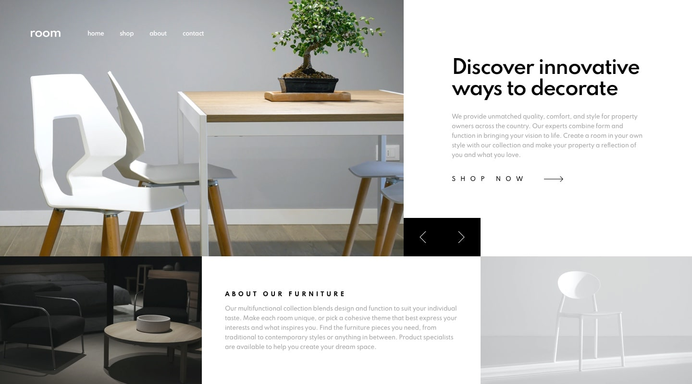
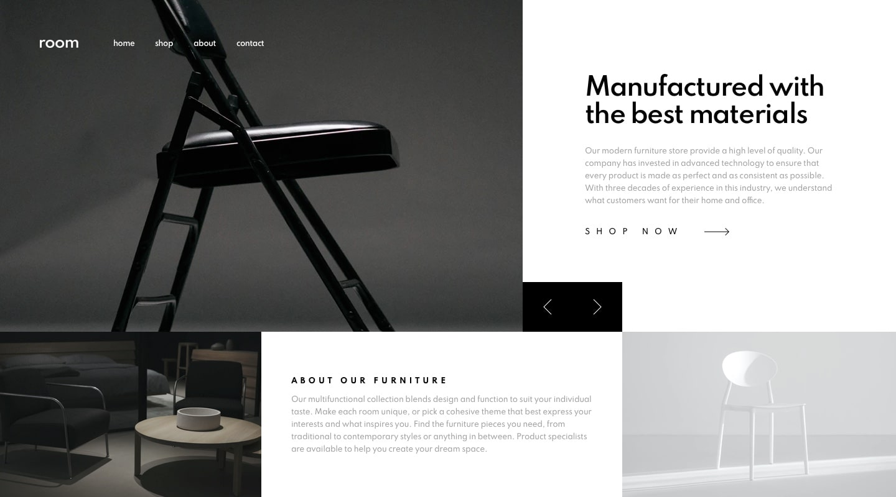

# fm-room-home-page

## Design

> Desktop

;

> Desktop Design Slide 1

> Desktop Design Slide 2

> Desktop Design Slide 3

> Mobile

;

> Mobile Navigation

;

## General

My challenge is to build out this e-commerce homepage and get it looking as close to the design as possible.

My users should be able to:

- View the optimal layout for the site depending on their device's screen size
- See hover states for all interactive elements on the page
- Navigate the slider using either their mouse/trackpad or keyboard